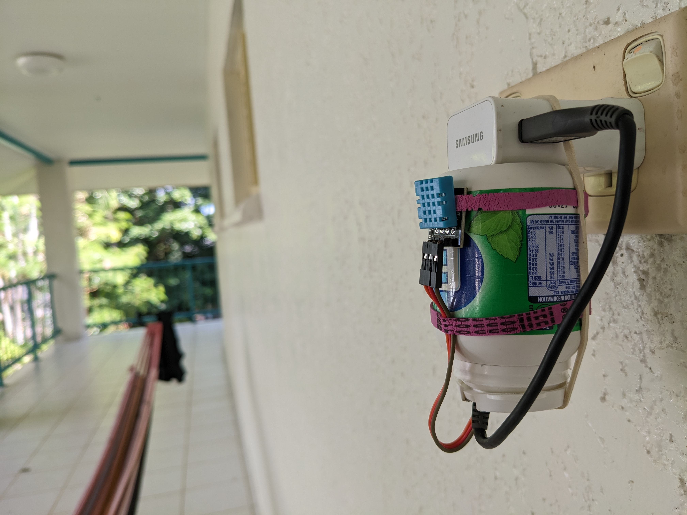
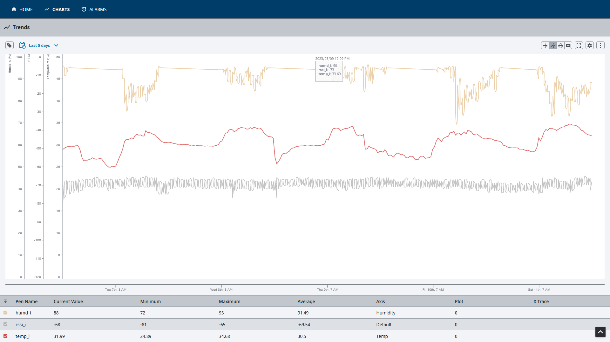

# Aralia Weather Station
Simple ESP32 based weather station that communicates with Ignition SCADA via MQTT. The sensor will take regular temperature and humidity readings. Weather data will to be read by Ignition SCADA for alarming and historical logging.

There are 3 subsystems required, they have been reviewed below.
- [ESP32 Firmware](#esp32-firmware)
- [MQTT Broker](#mqtt-broker) [Eclipse Mosquitto](https://mosquitto.org/)
- [MQTT > SQL Bridge service](#mqtt-sql-bridge)
- [Ignition SCADA](#ignition-scada)

## ESP32 Firmware
The role of the ESP32 MCU is to collect sensor data, and publish MQTT topics to the broker.
The ESP32 polls the DHT11 sensor every 10s. After each successful poll, the MCU publishes data to the MQTT (Mosquitto) broker. The data published is:
- float Temperature
- float Humidity
- float ESP32 Wifi RSSI (also to be used as heartbeat)

## MQTT Broker
This is a standard Mosquitto broker running on Windows Host. Config file has been posted for version control.

## MQTT SQL Bridge
As Ignition SCADA Maker Edition does not provide a MQTT bridge, a python service was developed that would subscribe to weather station topics, and write the recieved data to a table in the ignition database.

The service will continuously overwrite the first row of the database. There is no requirement to store this data, only put it into a format that ignition understands. A python virtual environment was created with required dependencies, then the MQTTSQLBridge was packaged as a windows service using NSSM (Non-Sucking Service Manager). This allows the script to automatically start on reboot. NSSM will call a .bat file that will activate the VENV and then run the script.

## Ignition SCADA
Ignition SCADA was configured with SQL tags.

    SELECT temp FROM mqtt_bridge WHERE id=1;

## Issues
DH11 sensor is only able to read a maximum humidity value of 95%. The humidity is above this for most of the Northern Territory wet season. 
