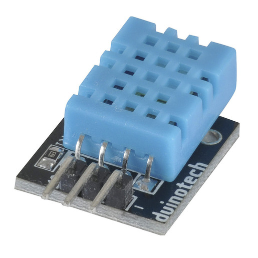

# Aralia Weather Station
Simple ESP32 based weather station that communicates with Ignition SCADA via MQTT. The sensor will take regular temperature and humidity readings to be displayed on Ignition SCADA historical chart.

There are 3 seperate subsystems that are required, they have been reviewd in further detail below.
- [ESP32 Firmware](#esp32-firmware)
- [MQTT Broker](#mqtt-broker) [Eclipse Mosquitto](https://mosquitto.org/)
- [MQTT > SQL Bridge service](#mqtt-sql-bridge)

## ESP32 Firmware
The role of the ESP32 MCU is to collect sensor data, and publish MQTT topics to the broker.
The ESP32 polls the DHT11 sensor every 10s. After eachsuccessful poll, the MCU publishes data to the Mosquitto (MQTT)broker; ARA-SVRDOK01. The data published is:
- float Temperature
- float Humidity
- float ESP32 Wifi RSSI (also to be used as heartbeat)

## MQTT Broker
This is a standard Mosquitto broker running on Windows Host. Config file has been posted for version control.

## MQTT SQL Bridge
As Ignition SCADA Maker Edition does not provide a MQTT bridge, a python service was developed that would subscribe to weather station topics, and write the recieved data to a table in the ignition database.

The service will continuously overwrite the first row of the database. There is no requirement to store this data, only put it into a format that ignition understands. The MQTTSQLBridge was packaged as a windows serviceusing NSSM (Non-Sucking Service Manager).This allowsthe scriptto automatically start on reboot.

